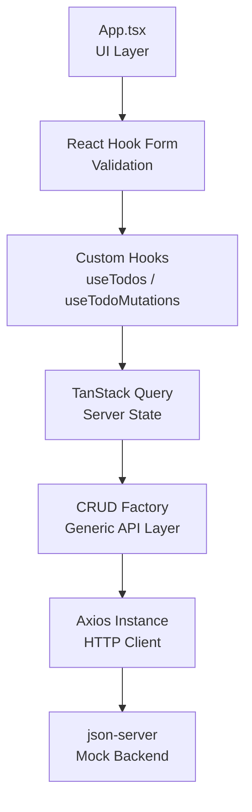

# Todo V2 📝

A scalable, type-safe Todo application built with **React 19**, **TypeScript**, and **TanStack Query**, showcasing clean architecture, reusable patterns, and a clear evolution path toward a full **PERN stack**.

This project focuses on **how** an application is structured rather than just **what** it does.


## 🚀 Features

- ✅ Create, update, and delete todos
- 🔄 Real-time UI sync using TanStack Query
- ⚡ Optimistic UI behavior with cache invalidation
- 🧩 Generic CRUD factory for scalable APIs
- 🧪 Artificial API delay for realistic UX testing
- 📝 Form validation using React Hook Form (`onBlur`)
- 🔔 Toast notifications for user feedback
- 🎨 Minimal, customizable UI with DaisyUI + Tailwind
- 📦 Feature-based folder structure
- 🔒 Type-safe APIs with shared domain models


## 🛠️ Tech Stack

### Frontend
- **React 19**
- **TypeScript**
- **Vite**
- **Tailwind CSS**
- **DaisyUI**
- **Material UI (Typography)**

### State & Data
- **@tanstack/react-query v5**
- **Axios**
- **React Hook Form**

### Backend (Mock)
- **json-server**


## 🧠 Architecture Diagram




## 📁 Folder Structure

```txt
src
├── api
│   ├── axiosInstance.ts      # Axios global configuration
│   ├── crudFactory.ts        # Generic CRUD abstraction
│   └── todo
│       ├── todo.api.ts       # Todo API implementation
│       └── todo.types.ts     # Shared domain types
│
├── hooks
│   ├── todo
│   │   ├── useTodos.ts           # Read todos
│   │   └── useTodoMutations.ts   # Create / Update / Delete
│
├── providers
│   └── QueryProvider.tsx     # React Query global config
│
├── App.tsx                   # UI + interactions
└── main.tsx                  # App entry point
```

## 🧠 Architecture Highlights

### 1️⃣ Generic CRUD Factory Pattern

Instead of rewriting API logic for every feature, this project uses a **generic CRUD factory**:

```ts
export const crudFactory = <T>(axios, endpoint) => ({
  getAll: () => axios.get(endpoint),
  create: (payload) => axios.post(endpoint, payload),
  update: (id, payload) => axios.patch(`${endpoint}/${id}`, payload),
  remove: (id) => axios.delete(`${endpoint}/${id}`)
})

```

✔️ Reusable  
✔️ Scalable  
✔️ Type-safe

Adding a new feature (e.g. `users`, `projects`) becomes trivial.

----------

### 2️⃣ TanStack Query for Server State

-   Automatic caching
    
-   Background refetching
    
-   Centralized loading & error handling
    
-   Query invalidation after mutations
    

```ts
queryClient.invalidateQueries({ queryKey: ['todos'] })

```

This keeps UI and server state **always in sync**.

----------

### 3️⃣ Axios Instance with Interceptors

```ts
axios.create({
  baseURL: "http://localhost:3000",
  headers: { "Content-Type": "application/json" }
})

```

Includes an **artificial delay interceptor** to simulate real backend latency during development.

----------

### 4️⃣ Form Handling & Validation

-   **React Hook Form**
    
-   Validation triggered on `onBlur`
    
-   Fully type-safe with shared `Todo` model
    

```ts
register("title", { required: "Title cannot be blank" })

```


## ▶️ Running the Project

### Install dependencies

```bash
npm install

```

### Start frontend

```bash
npm run dev

```

### Start mock backend

```bash
npm run server

```

Frontend runs on:

```
http://localhost:4200

```

Backend runs on:

```
http://localhost:3000

```

----------

## 🧪 API Example (json-server)

```json
{
  "todo": [
    {
      "id": 1,
      "title": "Learn React Query",
      "completed": false
    }
  ]
}

```

## 🛣️ Roadmap

### 🔹 V3 (Planned)

-   React Router
-   Authentication & user-based todos
-   Global hook factory
-   Protected routes
    

### 🔹 V4 (Planned)

-   Express + PostgreSQL
    
-   JWT authentication
    
-   Full PERN stack
    
-   Production-ready backend
    


## 💡 Why this project?

This project is designed to demonstrate:

-   Real-world frontend architecture
    
-   Scalable API patterns
    
-   Clean separation of concerns
    
-   Professional React + TypeScript practices
    

It is **not just a Todo app**, but a **foundation** for larger applications.


## 📌 Author
Built with ❤️ by **Manmay**