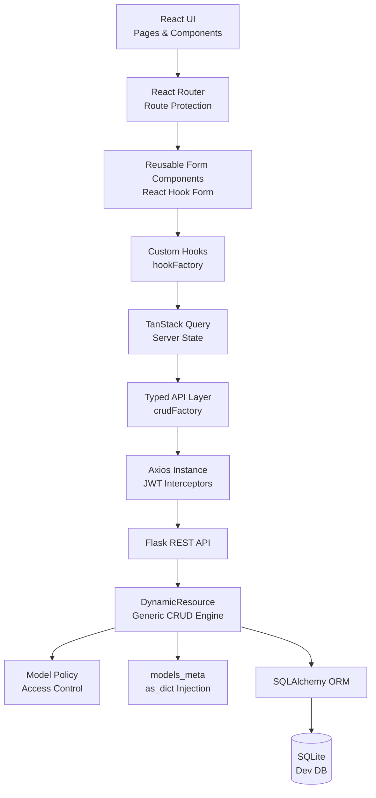

[](https://babaherons.in/todo-v3)
[](https://babaherons.in/api/todo-v3)
[](https://babaherons.in/api/todo-v3/docs)


# Todo V3 🧠

## 📌 Overview

**Todo V3** is a full-stack evolution of **Todo V2**, designed to demonstrate
**scalable application architecture** rather than just feature implementation.

This version introduces a **generic, policy-driven backend engine** using Python
and Flask, paired with an **enterprise-style React frontend** with strong typing,
route protection, and reusable abstractions.

The goal of this project is to build a **reusable foundation** that can scale
beyond a Todo app into real-world systems.

## 🔗 Live Demo & API

- 🌐 **Frontend (Live App)**  
  👉 https://babaherons.in/todo-v3

- 🔌 **Backend API Base URL (used by frontend)**  
  👉 https://babaherons.in/api/todo-v3

- 📄 **API Documentation (Swagger / OpenAPI)**  
  👉 https://babaherons.in/api/todo-v3/docs


## 🚀 Key Features

### Frontend
- React 19 + TypeScript
- Feature-based folder structure
- Reusable UI components
- Reusable loading & feedback components
- Protected and public routes (React Router v7)
- Typed API contracts and data flow
- TanStack Query for server-state management
- React Hook Form for scalable forms
- DaisyUI + Tailwind CSS
- JWT decoding and role-aware routing

### Backend
- Python + Flask RESTful API
- **DynamicResource**: generic CRUD engine
- Policy-driven model permissions
- SQLAlchemy ORM
- SQLite for fast local testing
- Centralized audit logging
- Lifecycle hooks (before/after create/update/delete)
- Automatic `as_dict()` injection via metaclass
- JWT-ready authentication layer


## 🛠️ Tech Stack

### Frontend
- React 19
- TypeScript
- Vite
- React Router v7
- TanStack Query v5
- React Hook Form
- Tailwind CSS
- DaisyUI

### Backend
- Python 3
- Flask + Flask-RESTful
- SQLAlchemy ORM
- JWT Authentication
- SQLite (development database)

---

## 🧠 Architecture Diagram



## 🧩 Backend Architecture Highlights

### 🔹 DynamicResource
A single reusable resource class that handles:
- GET (list, filter, pagination, column selection)
- POST (create with hooks)
- PATCH (partial updates)
- DELETE (safe deletion)

Includes lifecycle hooks:
- `before_create`
- `after_create`
- `before_update`
- `after_update`
- `after_delete`


### 🔹 Model Policies
Each model can define:
- Read-only behavior
- Patch / delete permissions
- Default ordering
- Role-based access rules

This keeps **authorization logic out of controllers**.

### 🔹 `models_meta` (Metaclass Injection)
All SQLAlchemy models automatically receive:
- `as_dict()` method
- Column filtering
- Relationship handling
- Safe datetime formatting

This ensures **consistent API responses** across the entire backend.

## 🧾 Audit Logging (Foundation – V3)

Todo V3 introduces a **structured audit logging system** designed to provide
full traceability of actions across the backend.

The goal in V3 is to **define a complete and future-proof audit schema**,
while selectively populating critical fields.  
Additional request-level and system-level context will be fully enabled in V4.

### 🔍 What is logged

Each audit entry captures:

#### 🧑 WHO (Immutable Identity)
- `actor_id`
- `actor_role`
- `actor_name`

This ensures actions remain traceable even if user data changes later.

#### 🎯 WHAT happened
- `action` (create, update, delete, view, login)
- `entity_type` (table / domain name)
- `entity_id` (record identifier)


#### 🧠 WHAT changed
- `old_data` (JSON snapshot)
- `new_data` (JSON snapshot)

This enables:
- Historical reconstruction
- Debugging
- Compliance-style audits


#### ⏱️ WHEN
- `created_at` (immutable timestamp)


### 🧱 Audit Schema (Design-Complete)

The audit schema is intentionally **broader than current usage**, allowing
seamless expansion without breaking changes.

```text
audit_logs
├── actor_id
├── actor_role
├── actor_name
├── action
├── entity_type
├── entity_id
├── old_data
├── new_data
├── ip_address        (reserved)
├── user_agent        (reserved)
├── request_id        (reserved)
├── source            (reserved)
├── status            (reserved)
├── failure_reason    (reserved)
└── created_at
```
### 🚧 Fields Reserved for V4

The following fields are defined but **not fully populated in V3**:

* `ip_address`
* `user_agent`
* `request_id`
* `source` (web / mobile / api / system)
* `status` (success / failed)
* `failure_reason`

These will be enabled in **V4**, alongside:

* Express middleware
* Request tracing
* Distributed logging
* Production-grade monitoring

## 🧠 Frontend Architecture Highlights

- `crudFactory` for typed API creation
- `hookFactory` pattern for scalable hooks
- Centralized Axios instance with JWT handling
- Strong typing for routes, APIs, and forms
- UI components designed for reuse across features
- Clear separation of UI, data, and logic layers

## 🔌 API Overview

The backend exposes a generic REST API powered by `DynamicResource`,
supporting CRUD operations, filtering, pagination, and policy enforcement.

For full endpoint details, see:
👉 [API Documentation](https://babaherons.in/api/todo-v3/docs)


## ▶️ Running the Project

This project is a **full-stack application** with:
- A **Python backend** located in `backend_api_python/`
- A **React frontend** located at the **root of the repository**

Backend and frontend must be started **separately**.


## 🔐 Environment Configuration (Backend)

Before running the backend, create a `.env` file inside the backend `src/` directory.

### 📁 Location
```text
backend_api_python/src/.env
```

### 📄 `.env` File Contents

```env
SECRET_TOKEN_KEY=this-is-a-very-secret-token-key
APP_SECRET_KEY=this-is-a-very-secret-app-secret-key

# Fernet encryption key
# Generate using Python shell:
# >>> from cryptography.fernet import Fernet
# >>> Fernet.generate_key()
FERNET_KEY=your-generated-fernet-key

# Default admin bootstrap credentials
DEFAULT_ADMIN_USERNAME=admin
DEFAULT_ADMIN_PASSWORD=admin
DEFAULT_ADMIN_EMAIL=admin@todo_v3.com
```

### ⚠️ Notes

* `.env` is required for backend startup
* Do NOT commit `.env` to version control
* Default admin credentials are for development only

## 🐍 Running the Backend (Python / Flask)

All backend commands must be executed **from the backend directory**.

### 1️⃣ Navigate to backend folder

```bash
cd backend_api_python
```

### 2️⃣ Create virtual environment (recommended)

```bash
python -m venv venv
source venv/bin/activate   # Linux / macOS
venv\\Scripts\\activate    # Windows
```

### 3️⃣ Install dependencies

```bash
pip install -r requirements.txt
```

### 4️⃣ Start the backend server

```bash
python3 main.py
```

Backend will start on:

```text
http://localhost:5000
```


## ⚛️ Running the Frontend (React)

Frontend commands are executed from the **root of the repository**.

### 1️⃣ Navigate to project root

```bash
cd ..
```

(or open a new terminal at the repo root)

### 2️⃣ Install dependencies

```bash
npm install
```

### 3️⃣ Start the frontend

```bash
npm run dev
```

Frontend will start on:

```text
http://localhost:4200
```

## 🔁 Full Local Startup Flow (Quick Summary)

```text
Terminal 1:
cd backend_api_python
source venv/bin/activate
python app.py

Terminal 2:
npm install
npm run dev
```

## 🧪 Default Admin Access (Development)

On first run, a default admin user is bootstrapped using values from `.env`:

* Username: `admin`
* Password: `admin`
* Email: `admin@todo_v3.com`

⚠️ Change these values immediately in production environments.

## ✅ Common Issues

* Backend fails to start → check `.env` file
* Unauthorized API errors → verify JWT secret keys
* Frontend cannot connect → confirm backend is running on port `5000`


This separation is **intentional** and mirrors real-world full-stack deployments.

## 📌 Author
Built with ❤️ by **Manmay**
